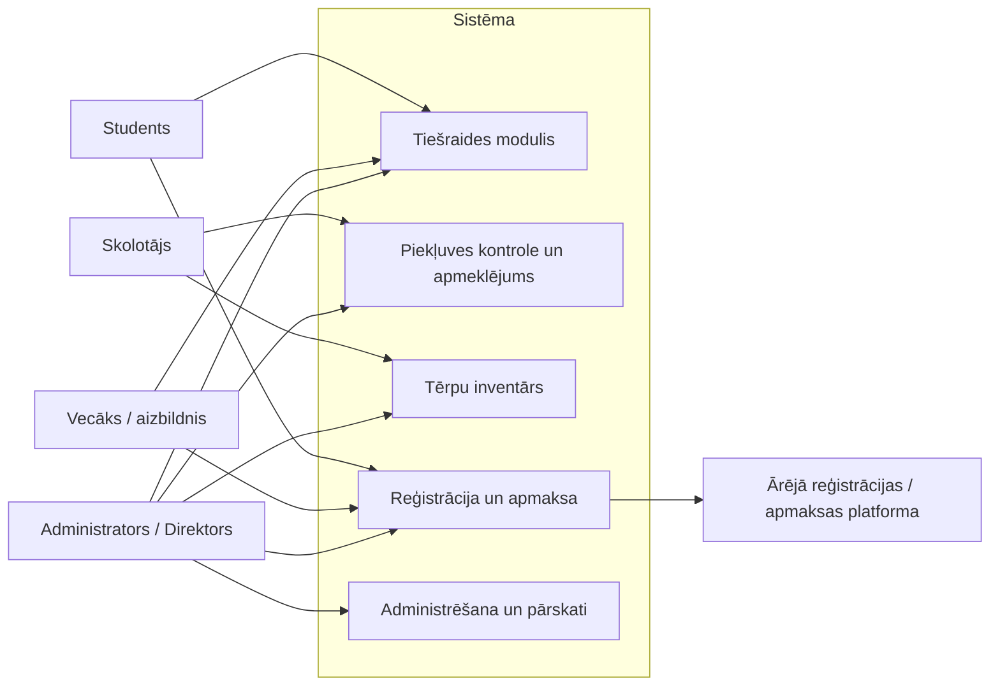

---
config:
  layout: elk
---

```mermaid
flowchart LR

%% Aktori
ST["Students"]
PA["Vecāks / aizbildnis"]
TE["Skolotājs"]
AD["Administrators / Direktors"]
EX["Ārējā reģistrācijas / apmaksas platforma"]

%% Sistēma
subgraph SYS["Sistēma"]
  LIVE["Tiešraides modulis"]
  ATT["Piekļuves kontrole un apmeklējums"]
  COST["Tērpu inventārs"]
  REG["Reģistrācija un apmaksa"]
  ADMIN["Administrēšana un pārskati"]
end

%% Saiknes
ST --> LIVE
PA --> LIVE

ST --> REG
PA --> REG
REG --> EX

TE --> ATT
TE --> COST

AD --> LIVE
AD --> ATT
AD --> COST
AD --> REG
AD --> ADMIN
```